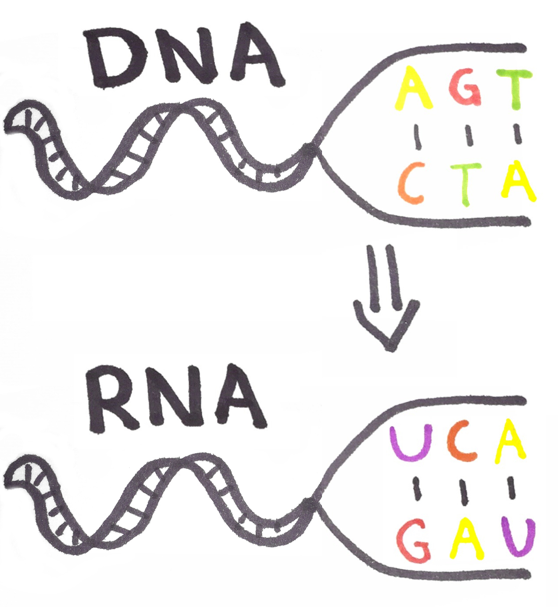

# ???

A small programming challenge that is used a lot to learn a language is translating a string to another representation. In this case, we will transcribe DNA nucleotides to RNA nucleotides and the language we will be using is Elixir. Elixir allows us to do some powerful stuff like pattern matching al the way down to the [binary level](<http://benjamintan.io/blog/2014/06/10/elixir-bit-syntax-and-id3/>).

To solve our challenge this we need to know the mapping between the nucleotides that make up a DNA strand and their representation in RNA. The mapping is A to U, G to C, T to A, and C to G. I've drawn out an example below.




So let's implement this in Elixir! We can define multiple functions with the same name, called same head functions, and use pattern matching on the argument to represent the mapping between the nucleotides.

Doing so we end up with the code below.


```elixir
defmodule RNATranscription do
  def to_rna("G"), do: "C"
  def to_rna("C"), do: "G"
  def to_rna("T"), do: "A"
  def to_rna("A"), do: "U"
end
```

Then we try out our module in the Elixir REPL (Read-Evaluate-Print Loop) called IEx (Interactive Elixir) and give it a valid DNA nucleotide and we see that we received the correct RNA nucleotide back.

```elixir
iex> import_file("rna.ex")
iex> RNATranscription.to_rna("T")
"A"
```

Using this module we could take a DNA strand, split it into a list of DNA nucleotides, map each nucleotide to its RNA equivalent, and join them to produce the RNA strand. One way to do this is written below using the REPL.

```elixir
iex> strand = "GCAATTA"
iex> string |> String.graphemes() |> Enum.map(&RNATranscription.to_rna/1) |> Enum.join()
```

And we're done. But, what if there is a new discovery of RNA or DNA nucleotides and there are additional letters to be added? We could write a few new functions matching new DNA nucleotides and returning the RNA ones. Though doable by hand, we could leverage the power of Elixir meta-programming and define functions from a mapping so a future extension is easy.

Before we get into applying metaprogramming to our example I want to go a bit in depth about it. One amazing thing about Elixir is that it for the most part written in Elixir! According to Github, it contains about 90% Elixir code and only 9% Erlang code as of the moment I wrote this blog post. Having a language written in the same language makes it easier to read the language source code and contribute, because you already know the language! This is because most of Elixir is build using metaprogramming on top of a small core. An example is `if/else` . This is a simple macro for `case`. So the example code below:

```elixir
if is_thruthy?() do
	do_something()
else
	do_something_else()
end
```

Gets compiled down in an intermitted step to:

```elixir
case is_thruthy?() do
  x when x in [false, nil] ->
    do_something_else()
  _ ->
    do_something()
end
```

You can read more about in the source code in the Kernel library: https://github.com/elixir-lang/elixir/blob/master/lib/elixir/lib/kernel.ex#L3054. One beautiful thing you can see here is how Elixir works. As you can see the only falsely values are `false` and `nil` , everything else is truthy.

To get a sense of how we can implement something like this, let's try something out in the REPL. Using [`unquote`](<https://hexdocs.pm/elixir/Kernel.SpecialForms.html#unquote/1>) we can take an expression and make it static on compile time. And with [`quote`](<https://hexdocs.pm/elixir/Kernel.SpecialForms.html#quote/2>) we can receive the AST (Abstract Syntax Tree) from the block passed to check what we've created. The AST is what Elixir uses to represent our code before compiling down to Erlang. To see what the AST represents we use [`Macro.to_string/1`](<https://hexdocs.pm/elixir/Macro.html#to_string/2>).

```elixir
iex> dna = "G"
iex> ast = quote do
...> unquote(dna)
...> end
iex> dna = "C"
iex> IO.puts Macro.to_string(ast)
"G"
```

As you can see in the code above the unquote function gives us the value `"G"` back even if we change the value of `dna` afterwards. We can experiment further and see if this can be used to set the value to match the argument on in our same head pattern matching. We write the `to_rna` as we normally would but swap out the argument and return value with the unquoted values of the DNA and RNA.

```elixir
iex> dna = "G"
iex> rna = "C"
iex> ast = quote do
...> def to_rna(unquote(dna)), do: unquote(rna)
...> end
iex> IO.puts Macro.to_string(ast)
def(to_rna("G")) do
  "C"
end
```

As you can see the value `"G"` is set as the argument and `"C"` as the return value. This looks exactly like one of the functions we wrote by hand. But instead of writing it by hand, we've used the value of `dna` to set the value on which the `to_rna` function needs to match and `rna` to set it as the return value. Now knowing this we could bring everything together and create functions for our mapping. We need to create the DNA to RNA mapping and create for each key and value pair a function that matches on the DNA and returns the RNA. We'll use a simple `for`-comprehension for looping through our mapping. 

```elixir
defmodule RNATranscription do
  mapping = %{ "G" => "C", "C" => "G", "T" => "A", "A" => "U" }
  for { dna, rna } <- mapping do
    def to_rna(unquote(dna)), do: unquote(rna)
  end
end
```

We load the file in the REPL it gets compiled and all functions get defined.

```
iex> import_file("rna.ex")
iex> RNATranscription.to_rna("T")
"A"
```

We've created compile-time functions! We could go even further and automate it further by hosting the mapping somewhere, use a hook to create an Elixir package out of it when it changes, and publish it without interaction of a developer.

Elixir macros allow us to create awesome stuff. Though this awesomeness does come with a word of caution. It might be harder to reason about what your code does and where some functions come from. New developers to your project with macros might have a hard time finding their way around. It is a tradeoff you have to make. Some would argue that using macros for such a small mapping we used might be overkill and I won't argue with that. But, it is fun to write it and show you how you can define compile-time functions.