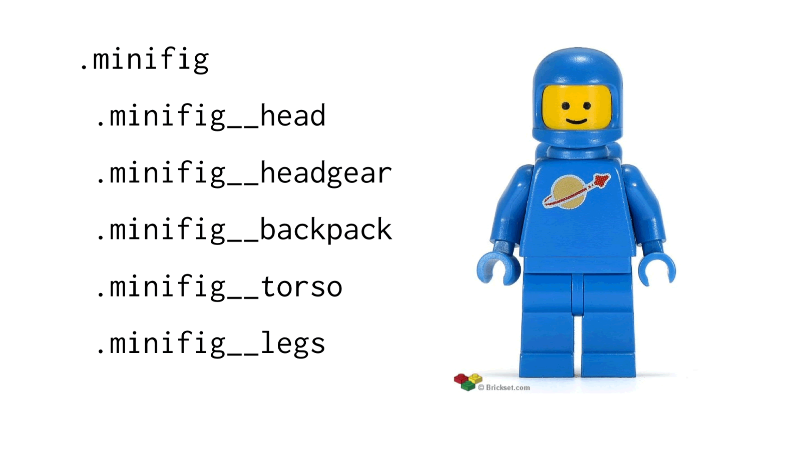
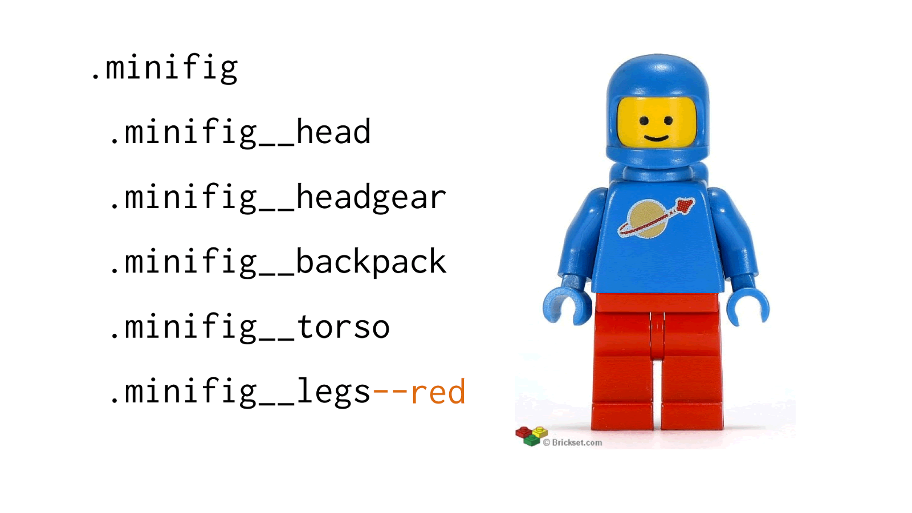

# BEMIT, CSS! You're going Atomic!

At Avisi we developed a few toolkits for projects to achieve a high reusability
in front-end components.

BEMIT is a combination of two conventions [*BEM*](http://getbem.com/) and
[*IT*CSS](https://itcss.io/). These give us some answers to problems we were
facing. How do we write CSS? BEM! How do we structure our CSS? ITCSS! Both gave
us the power to write awesome toolkits that are used in multiple projects.

Before we get to how we do it, we need a quick introduction to both conventions
to know what we are talking about.

## BEM?

[BEM](http://getbem.com/) stands for Block-Element-Modifier and it is a naming
convention for writing CSS. There are many tutorials to be found on the web so
below I'll explain it simply using images. If you want more information you can
visit the official website at http://getbem.com/.

I find that to explain something modular, [LEGO™](https://www.lego.com/) is
always an easy to understand the concept.

So we start with something really simple. A figure that we give it the block
identifier `.minifig`. Our figure is by default the color blue.


```css
.minifig {
  color: blue;
}
```

A figure is made up from a few parts such as the legs, torso, arms, etc. All
these parts are elements on the block `minifig`.


```css
.minifig,
.minifig .minifig__head,
.minifig .minifig__headgear,
.minifig .minifig__backpack,
.minifig .minifig__torso,
.minifig .minifig__legs {
  color: blue;
}
```

If we want a different color `minifig` we apply the modifier `--red` to the whole
block and all elements change color to red.


```css
...

.minifig--red,
.minifig--red .minifig__head,
.minifig--red .minifig__headgear,
.minifig--red .minifig__backpack,
.minifig--red .minifig__torso,
.minifig--red .minifig__legs {
  color: red;
}
```

Let's say we only want to change its legs to red, but we don't want to change
the whole figure to red. How do we do that? Well, modifiers are not limited to
the block. So we can use the `--red` modifier on the legs element and it changes
to red!


```css
...

.minifig .minifig__head--red,
.minifig .minifig__headgear--red,
.minifig .minifig__backpack--red,
.minifig .minifig__torso--red,
.minifig .minifig__legs--red {
  color: red;
}
```

As you can see this a lot of selectors to write. But it gives you also a lot of
power as we will see later on in this post. To mitigate the number of selectors
we write, we use the CSS preprocessor [SCSS](https://sass-lang.com/). SCSS allows
us to write dynamic CSS with loops. So if a new color gets introduced, say green,
we just add it to our list of possible colors and the CSS selectors containing
the BEM modifiers are automatically generated for us. Below is a small snippet
to see how that looks for our minifig.

```scss
$colors: (
  blue: #0000FF,
  red: #FF0000,
  green: #00FF00
)

@each $name, $color in $colors {
  .minifig {
    & .minifig__head--#{$name} {
      color: $color
    }
  }
}
```

Modifiers make for a powerful dynamic CSS. It allows us to control the appearance
of elements without having to whole new blocks and elements. You can use them to
make amazing components. Just like we could change the look our minifig into
something of a different theme, maybe Batman! You get the idea.


### Why did we choose BEM?

There are many others to choose from like [SMACSS](https://smacss.com/) and
[OCCS](http://oocss.org/). Out of our options, we liked BEM the most for it's easy
to understand semantic conventions. The users of our toolkit do not always have
knowledge of writing CSS, so we have to provide a way to use the toolkit without
having also to learn CSS. Further, the style of write selectors fits with
[Atomic Design](http://bradfrost.com/blog/post/atomic-web-design/).

## ITCSS?

ITCSS stands for *I*nverted *T*riangle *CSS*. It describes a way to organize our
CSS files in a way to deal with CSS [specificity](http://cssspecificity.com/).

ITCSS is agnostic of any other methodologies like BEM, SMACSS, or OOCSS. And stands
on its own. The triangle of ITCSS is broken down into a few layers that categorize
the type of files placed in each layer. It’s important not to output any CSS in
the first two layers as you will see from the concepts explained below.

*Settings* - this is used with preprocessors, like SASS, and contain things fonts,
colors, breakpoints, and other definitions.

*Tools* – globally used mixins and functions used by preprocessors. For example,
we store here a function that converts a unit in pixels to `rem` given a
base-size we passed along.

*Generic* – reset and/or normalization of styles. Like setting box-sizing
definitions or [normalize.css](https://necolas.github.io/normalize.css/).

*Elements* – layer for styling HTML elements (like `h1`, `a`, `p`, etc.). Here
we set default line heights and font-size. We only target elements that come with
a default style set by browsers. Things like `div` or `article`, that don't have
any default styling, are left alone.

*Objects* – class-based selectors which define undecorated design patterns.
Examples are like a simple `.wrapper` element, layout systems, or the media object
known in the OOCSS methodology.

*Components* – the layer for UI components. Here we place the majority of our CSS.
You place all your block components, following the BEM methodology, in this folder.
An example is a button component. Which contains the button block, it's elements,
and modifiers and is placed in a single file called `button.scss`. 

*Utilities* – or alternatively called *Trumps*. This is the layer with the highest
specificity. In this layer, you can find the only instances where `!important` is
allowed. An example would be a helper class to hide an element. Since the
specificity of a selector called `.hidden`, which job is to set `display: none`,
is not enough to overrule other selectors.

Below you can see, visually, how each layer is positioned in the inverted triangle.

TODO: insert image

In the root of the toolkit, we have created folders that are the same name as the
concepts of ITCSS. So there is a folder called settings, elements, etc.  Since
we use SCSS, we have in the root of the toolkit a file called `index.scss` in
which we import all the files in the subfolders. The order of imports corresponds
to the order of layers. So we start with importing settings, then tools, then
generic and so on.

If you are interested in the idea why you can watch the original designer, Harry
Roberts, explain it in his video ["Managing CSS Projects with ITCSS"](https://www.youtube.com/watch?v=1OKZOV-iLj4)

## So how do you use it with Atomic Design?

A quick recap of Atomic Design: start with the smallest possible element, an atom,
and gradually build up your page with by putting together atoms into molecules.
Molecules into organisms. Organisms into templates.

We will take our Avisi toolkit, used on the [website](https://www.avisi.nl) and
internal projects, as an example. Our designer starts the process with designing
all the basic elements of the periodic table of HTML elements and atoms (you can
read more about his process in subsequent blog posts [here](#TODO)). After the
design process, a design document is delivered.

Based on his design document we start with extracting settings. Our toolkit has
four primary colors, so those are defined as variables in a file called `colors.scss`
placed in the folder `settings` and import it in our `index.scss` file so it
becomes globally accessible in the toolkit. Same goes for fonts and other variables.

We use [box-sizing](https://www.paulirish.com/2012/box-sizing-border-box-ftw/) and
[normalize.css](https://necolas.github.io/normalize.css/) to set a consistent base
for all browsers to start from. Those go as separate files in the `generic` folder
with corresponding imports in our index SCSS file.

Then we look at the elements that have default styling in browsers, like the `p`
element. In the design document, there are styles defined like line height, font
family, and font size. For each HTML element, we create a file in `elements` folder
and import them.

### Atom
With a base for our toolkit set, we start building the real heroes of the toolkit,
the atoms!

An atom is something really small. A few examples are buttons, search fields,
labels, logo's, links etc. Using BEM we make create all these small atoms as
blocks. An easy example of an atom is a button. We created a file called
`button.scss` in the *components* folder and add our import under the components
section int he `index.scss`.

The button has some "behavior" such as being visually displayed as a primary or
secondary button. Also, the button comes in four colors which are defined in our
settings. So, as we talked about in our BEM introduction, we create a button block
with a base styling which has no color. Then, using our primary colors, we enumerate
through each color and create the appropiate modifiers. The primary and secondary
version is also available as BEM modifiers. This means that the component has
6 possible combinations. This is based on 1 (`.button`) * 2 (`--secondary` and
`--primary`) * 4 (`--blue` and the rest of the colors). This is just an example.
In our toolkit the button can also be displayed as disabled and has four possible
sized, thus creating even more options. As you can see BEM can be really powerful!

### Molecule

Molecules are a collection of atoms. These are interesting things. Each atom
knows how it looks, but does not know where it is put. How do we say to button that
it needs to the right of a search field? The answer is relatively simple. In a
molecule, where atoms come together, you place position each element. Let's take
a menu as an example. A menu is a collection of links. Each link knows how it looks
and behaves and the menu knows how to position its children, the links. If the
menu were to change of direction, from default horizontal to vertical. The menu
would receive a modifier that changes how it's children are positioned. In our
toolkit molecules are defined in separate files within the `components` folder
and follow BEM. Below is the HTML structure for our menu.

```html
<menu class="menu menu--vertical">
  <a href="..." class="menu__item link">Item 1</a>
  <a href="..." class="menu__item link">Item 1</a>
  <a href="..." class="menu__item link link--active">Item 1</a>
  <a href="..." class="menu__item link">Item 1</a>
</menu>
```

As you can see, we allow the elements (`.menu__item`) under our menu to also be
a block on their own. This is not enforced by the BEM naming convention, but we
want to avoid [`div`-itis](https://csscreator.com/divitis). This is up to
you to decide.

### Organisms

Organisms are composed of multiple molecules together. Most of the time we have
to write any CSS for this! Only HTML. In a few cases, we have to write a block
with elements to position the molecules. An example would be the header. Our
header is composed of the logo atom and menu molecule where the logo is
positioned to the left and menu to the right. While a header is a common example
I want to give one more where we can see the power of Atomic Design and BEMIT.

One organism we use on our site is `tiles`. The tiles component displays four
links with titles and images. Below is you can see an example with content
filled in.


This use the `title` and `box` atoms and `box` molecules. Below is a the HTML for
the tile organism.
```html
<div class="tiles tiles--2h2v">

  <a class="tiles__tile tiles__tile--purple tiles__tile--1 tiles__tile--no-slope tile">
    <div class="tile__content">
      <p class="tile__subtitle">...</p>
      <h4 class="tile__title ">...</h4>
    </div>
  </a>

  <a class="tiles__tile tiles__tile--blue tiles__tile--2 tiles__tile--no-slope tile">
    <div class="tile__content">
      <p class="tile__subtitle">...</p>
      <h4 class="tile__title ">...</h4>
    </div>
  </a>

  <a class="tiles__tile tiles__tile--green tiles__tile--3 tiles__tile--slope-right tile">
    <div class="tile__content">
      <p class="tile__subtitle">...</p>
      <h4 class="tile__title ">...</h4>
    </div>
  </a>

  <a class="tiles__tile tiles__tile--orange tiles__tile--4 tiles__tile--slope-left tile">
    <div class="tile__content">
      <p class="tile__subtitle">...</p>
      <h4 class="tile__title ">...</h4>
    </div>
  </a>

</div>
```

There are a few notable things to few here. Each tile is a molecule and thus
could be copied and used anywhere. Each tile has a content element that has a
color which can be changed and a slope that could go down to the right, left, or
no slope at all. 
An important thing to notice is the `.tiles--2h2v` modifier. Because
we use CSS grid we could change the entire positioning of elements for the
organism by changing one modifier. In `2h2v` the `h` stands for horizontal and
`v` for vertical. The `2` stands for elements to the left or right of the middle.
But it is not limited to that layout only. We made a total of five modifiers.
These modifiers are `2h2v`, `2v2h`, `4v` (shorthand for `2v2v`), `1h2v`, and
`2h1v`. Each layout modifier positions the elements, numbered from 1 till 4, in
specific locations using CSS grid area.

For each tile there 12 options based on this formula:
1 (tiles molecule) *
3 (for each choice of slope) * 1 (for one organism).
4 (four color options per tile) *

This combination of atoms and molecules makes this organism highly dynamic with
roughly 216 possible options! Because this one organism has tiles which each has
12 options, there are four tiles in three version of the layout (like `.tiles--2h2v`),
and three tiles in two layout versions (`.tiles---2h1v` and `.tiles--1v2h`). Which
make the following sum: (1 * 4 * 3 * 12) + (1 * 3 * 2 * 12) = 216. Which is a lot
for something as normally static like CSS and HTML!

### Templates and pages

The templates are only build using HTML and using the organisms, molecules, and
atoms we created. All that is left from this layer is placing everything together
and fill in the content to make a page.


We are really pleased with the combination BEMIT (BEM + ITCSS) which allows us to
create an awesome toolkit which we are still improving as we learn more from other
internal projects on which we apply Atomic Design.
