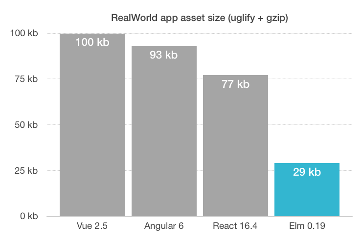

slidenumbers: true
autoscale: true

> elm 0.19
> What's new?

---

---

---

# Functions 

- `(,)`, `(,,)` etc. => `Tuple.pair`
* Removed from Basics: `toString`, `uncurry`, `curry`, `flip`, and `(!)`
* `String.toInt : String -> Maybe Int` (no `Result`)
* `String.toFloat : String -> Maybe Float` (no `Result`)
* `String.fromInt`/`String.fromFloat`
* `Basics.toString` => `Debug.toString`

---

# Functions

* `Basics.crash` => `Debug.todo`
* `Basics.rem 451 10` becomes `remainderBy 10 451`
* `451 % 10` becomes `modBy 10 451`

---

> Performance!

---

# Performance!

* Better compile times!!! (~2 seconds for 50k LOC)
* List.foldr is 30% faster (List.map, List.filter and List.append)
* Dict has 170% faster inserts and 30% faster removals
* Set has comparable improvements to Dict as it is a thin wrapper around it
* Random functionality has speedups of 20% to X00% on different operations

---

* Basic values and values of types like `type Height = Height Float` are unboxed (faster comparison)
* `--optimize` flag
* DCE (Dead Code Elimination)

---

---

# Packages

* elm-lang/\* moved to elm/\*
* evancz/url-parser moved to elm/url with a simpler and more flexible API
* elm-tools/elm-parser moved to elm/parser with speed boost when compiling with the --optimize flag
* Json.Encode/Json.Decode moved to elm/json
* Time and Date moved to elm/time with a significantly improved API + timezones!!

---

# Packages

* Random moved to elm/random with a better implementation and a few new functions
* Regex moved to elm/regex with a much clearer README

---

# Packages

* elm/browser combines and simplifies the following 0.18 packages:
    * elm-lang/navigation with smoother APIs
    * elm-lang/dom with ability to get node positions and dimensions.
    * elm-lang/mouse with decoders
    * elm-lang/window
    * elm-lang/keyboard uses decoders like this
    * elm-lang/page-visibility
    * elm-lang/animation-frame

---

> No more infix operators!!

--- 

---

# SPA

- `Html.beginnerProgram` -> `Browser.sandbox`
- `Html.program`/`Html.programWithFlags` -> `Browser.element`/`Browser.document`

---

# Other

* String.map/foldl/foldr/uncons now consider Char to be a Unicode codepoint rather than an UTF-16 byte.
* String.toInt no longer recognises the 0x prefix.
* The random number generator has been switched to PCG, which has better properties
* A number of bugs fixed in Array.
* Color module got removed.
* No need to maintain separate elm.json for tests!
* No more shadowing variables (compiler error)

---

# Other

* Stricter Record update syntax (no changing of types)
* Html.Attributes.style : List (String, String) -> Attribute msg becomes String -> String -> Attribute msg
* Local caching of packages (faster installation)
* Tuples are maxed out at 3 items

---

# Other

* Forbidden to expose everything (be explicit)
* The virtual-dom package now allows synchronous event handling

---

# Sadly, this didn't make it

* No code splitting
* No server-side rendering
* No lazy-loading

---

> TMI, should I upgrade?
