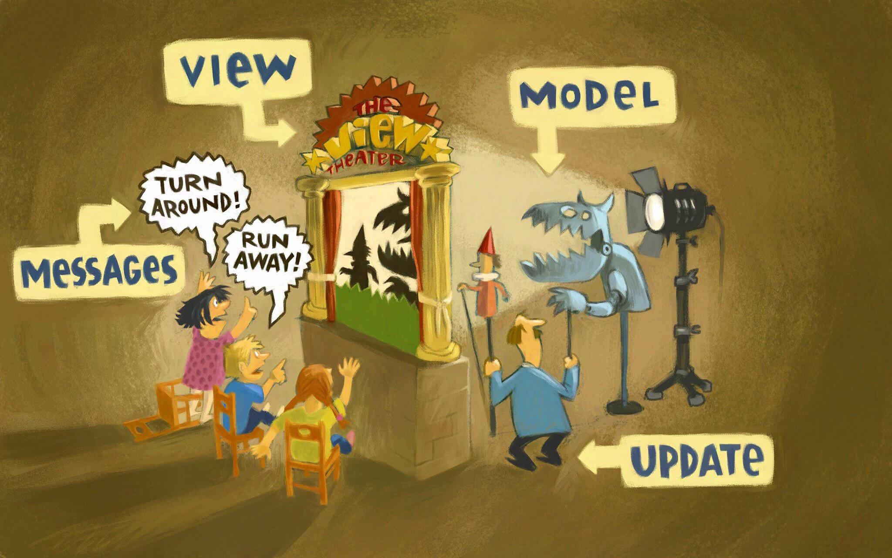

## Not My Cup of _TEA_

## 🫖

---

T*E*A = The _Elm_ Architecture

---

---

- _Model_ State of the application
- _View_ HTML output based on the Model
- _Update_ Changes the Model based on the messages
- _Message_ Commands for the Update

---

Let's dive in
🤿
