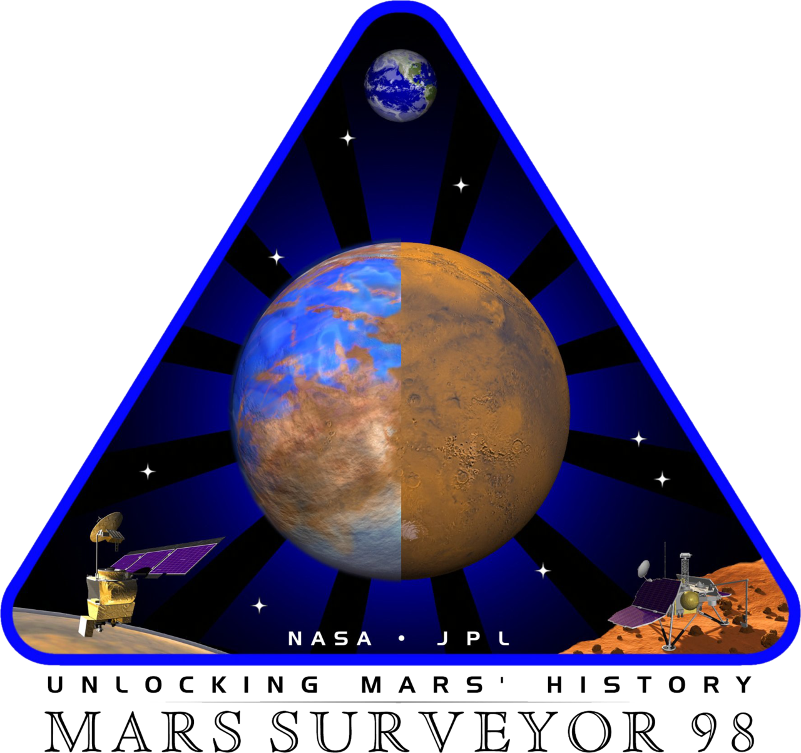
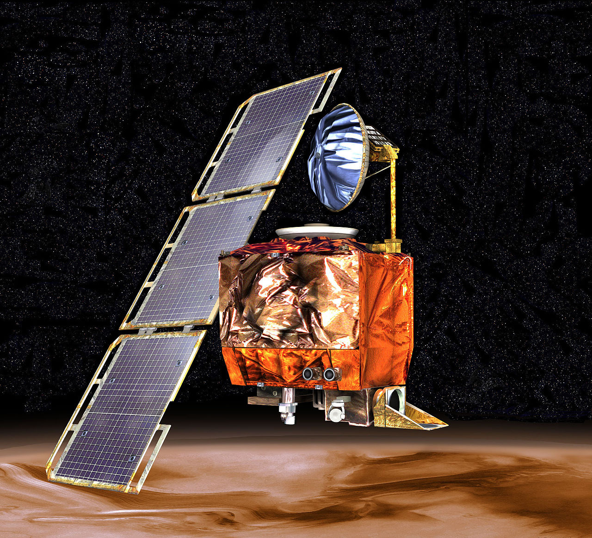

autoscale: true
code-language: elm
theme: Poster, 1

## _Phantom Types_ of The Opera

# 🎭

---

The Mars Climate Orbiter



---

Launched in 1998 to survey the climate on Mars, it was a marvel of ingenuity and _international effort_.
In 1999, communication was suddenly lost when the _satellite entered the atmosphere_.



---

The Mars Climate Orbiter failed because one team used _**imperial units**_ while another used _**metric units**_, causing a navigation error that led to the spacecraft burning up in Mars’ atmosphere.

---

```
-- Imperial
miles : Float
miles = 6.21

-- Metric
kilometers : Float
kilometers = 10.00

-- Crash! 💥
finalDistance : Float
finalDistance = miles + kilometers
```

---

# Possible solution?

[.code-highlight: 1]
[.code-highlight: 3-5]
[.code-highlight: 8]
[.code-highlight: 10-12]

```
type Miles = Miles Int

addMiles : Miles -> Miles -> Miles
addMiles (Miles a) (Miles b) =
   Miles (a + b)


type Kilometers = Kilometers Int

addKilometers : Kilometers -> Kilometers -> Kilometers
addKilometers (Kilometers a) (Kilometers a) =
   Kilometers (a + b)
```

---

## Phantom Types 👻

A phantom type is a _**parameterized type**_ where _**one or more parameters**_ on the left hand side _**do not appear**_ on the right hand side.

---

[.code-highlight: 1]
[.code-highlight: 2-3]
[.code-highlight: 6]
[.code-highlight: 7]

```
type APhantomType a
    = Variant1
    | Variant2


usage1 : APhantomType MyUnit
usage1 = Variant1

```

---

[.code-highlight: 1]
[.code-highlight: 2-3]
[.code-highlight: 6]
[.code-highlight: 7]

```
type APhantomType a b
    = Variant1 b
    | Variant2


usage1 : APhantomType MyUnit Int
usage1 = Variant1 10
```

---

```
validate :  FormData Invalid -> Result error (FormData Valid)

submit : FormData Valid -> Cmd Msg
```

---

Let's make something together
🏗️

---
