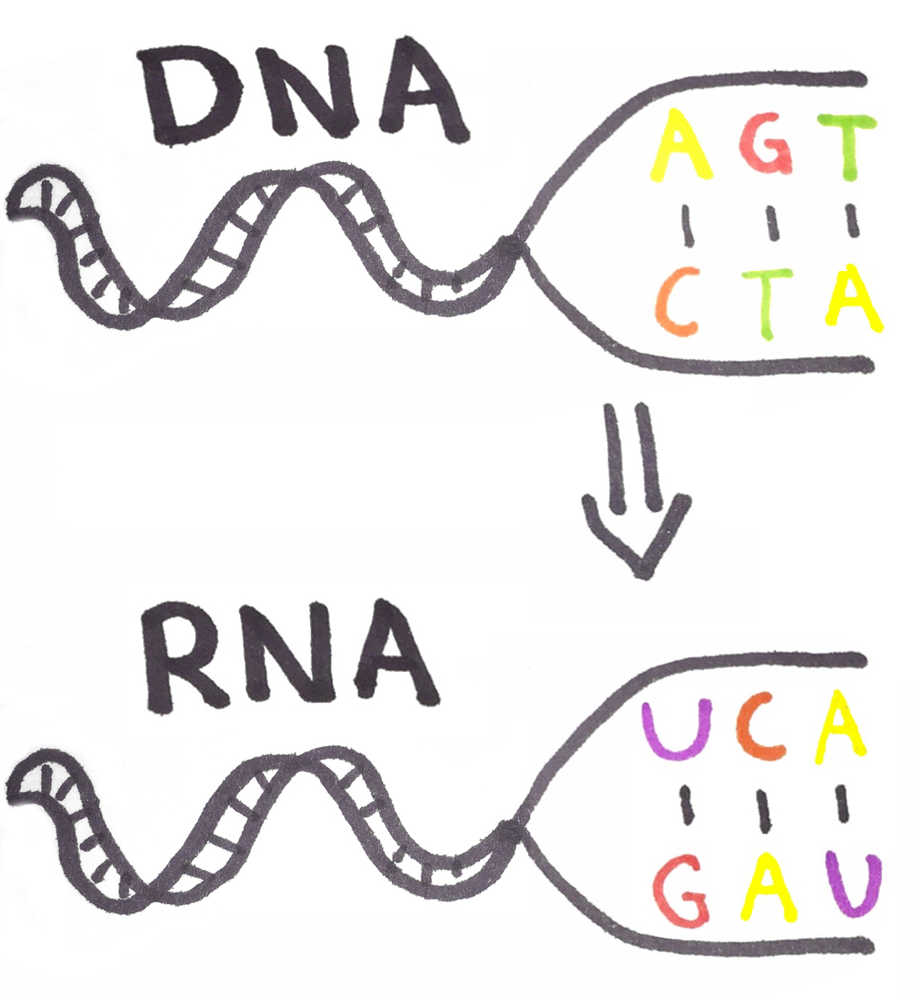

slidenumbers: true
theme: Sketchnote,1


# Welcome!

If you haven't installed Elixir, follow the instructions on:

https://elixir-lang.org/install.html

---


# Drinking the Elixir
### Brian van Burken

---

# Agenda

- 15:00 - 15:30 Presentation
- 15:30 - 17:30 Challenges
- 17:30 - 18:30 Food!
- 18:30 - 19:00 Announcing winners

---

# Elixir?

- build on top of Erlang
- inspired by Ruby
- immutable
- functional
- dynamiclly typed
- weakly typed, optionally strong

^ Elixir is build because Jose was unable to make Ruby concurrent

---

# Syntax

^ All code in slides are executable using the REPL called IEx

---

```elixir
iex> 1          # integer
iex> 0x1F       # integer
iex> 1.0        # float
iex> true       # boolean
iex> :hello     # atom
iex> "elixir"   # string
iex> ?A         # char
iex> <<0, 255>> # binary 
iex> [1, 2, 3]  # list
iex> {1, 2, 3}  # tuple
iex> %{1 => 2}  # map
```

^ atom is not garbace collected

---

```elixir
iex> 1 + 2
3
iex> Kernel.+(1, 2)
3
iex> "Hello " <> "there!"
"Hello World!"
iex> is_binary("hellö")
true
iex> String.length("hellö")
5
iex> String.upcase("hellö")
"HELLÖ"
```

^ All operators are also functions on Kernel that you can call
^ Elixir supports full UTF-8

---

# Functions

```elixir
iex> greet = fn x -> "Hello #{x}!" end
#Function<6.128620087/1 in :erl_eval.expr/5>
iex> greet.("there")
"Hello there!"
```

---
[.code-highlight: 1-7]
[.code-highlight: 8-12]

# Modules

```elixir
# greeting.ex
defmodule Greeting do
  def hello(), do: hello("world")
  def hello(thing) do
    "Hello " <> thing <> "!"
  end
end

iex> load("greeting.ex")
iex> Greeting.hello()
"Hello world!"
iex> Greeting.hello("there")
"Hello there!"
```

---

# Arity

```elixir
iex> nested = [ "there", "techday" ]
iex> Enum.map(nested, &Greeting.hello/1)
["Hello there!", "Hello techday!"]
```

^ Each function with the same name is identified by its number of arguments

---

# Pattern matching

---

# Destructuring

```elixir
iex> [1, a] = [1, 2]
iex> a
2
iex> {:ok, {:hello, a}} = {:ok, {:hello, "world"}}
iex> a
"world"
iex> [2, a] = [1, 2]
** (MatchError) no match of right hand side value: [1, 2]
```

^ everything on the left-hand is matched against the right-hand

---
[.code-highlight: 1,4]
[.code-highlight: 2]
[.code-highlight: 3]

# Responses

```elixir
iex> case File.read("path/to/file") do
...>   {:ok, binary_contents} -> IO.puts(contents)
...>   {:error, reason} -> IO.puts("Error: " <> reason)
...> end
```

^ Contents is a binary string

---

# Same-head functions

```elixir
defmodule Fibonacci do
  def fib(0), do: 0
  def fib(1), do: 1
  def fib(n) when n > 0, do: fib(n-2) + fib(n-1)  
  def fib(_), do: raise "Invalid input: need zero or higher"
end
```

^ here we pattern match on the argument
^ with an underscore we can say that we aren't interested in the value

---

# Binary pattern matching

"Get from a MP3 file the title, artist, album, and year"

---


---
[.code-highlight: 1-2,19-20]
[.code-highlight: 3-4,15-18]
[.code-highlight: 5]
[.code-highlight: 6]
[.code-highlight: 7-14]
[.code-highlight: all]

```elixir
defmodule ID3Parser do
  def parse(file_name) do
    case File.read(file_name) do
      {:ok, contents} ->
        song_byte_size = (byte_size(contents) - 128)
        << _ :: binary-size(song_byte_size), id3_tag :: binary >> = contents

        << "TAG",
            title  :: binary-size(30), 
            artist :: binary-size(30), 
            album  :: binary-size(30), 
            year   :: binary-size(4), 
            _      :: binary >> = id3_tag

      _ -> 
        IO.puts "Couldn't open #{file_name}"
    end
  end
end
```

^ first we get the size of MP3 song
^ then we extract the ID3 tag
^ at last we match exactly on "TAG" and use the rest to get the data we need

---

# Meta-programming

---

Most of Elixir is written in Elixir!


^ Most of the language consists of macro's created by elixir itself
^ Easier for people to read source-code to see what function does and to contribute

---
[.code-highlight: 1-5]
[.code-highlight: 5-15]

```elixir
if working?() do
  do_something()
else
  do_something_else()
end

# becomes:

case working?() do
  x when x in [false, nil] ->
    do_something_else()
  _ ->
    do_something()
end
```

^ "if" is just an macro for the case
^ this is readable from the elixir source code
^ warning: don't use a lot of macro's. Code can become unreadable

---

# Compile time

```elixir
iex> number = 2
iex> quote do: 1 + unquote(number)
{:+, [context: Elixir, import: Kernel], [1, 2]}
```

^ here the runtime number is taken and put in place of the unquote

---

```elixir
iex> number = 2
iex> ast = quote do: 1 + unquote(number)
iex> Macro.to_string(ast)
"1 + 2"
```

---

# Compile-time functions

"Convert a given DNA strand to its RNA complement."



---
[.background-color: #FFFFFF]


---

```elixir
# rna.ex
defmodule RNATranscription do
  def to_rna(?A), do: ?U
  def to_rna(?G), do: ?C
  def to_rna(?T), do: ?A
  def to_rna(?C), do: ?G
end

iex> load("rna.ex")
iex> RNATranscription.to_rna(?T)
?A
```

^ But what if we add new letters or the whole spec changes?

---
[.code-highlight: all]
[.code-highlight: 3]
[.code-highlight: 4,6]
[.code-highlight: 5]
[.code-highlight: all]

```elixir
# rna.ex
defmodule RNATranscription do
  mapping = %{ ?G => ?C, ?C => ?G, ?T => ?A, ?A => ?U }
  for { dna, rna } <- mapping do
    def to_rna(unquote(dna)), do: unquote(rna)
  end
end

iex> load("rna.ex")
iex> RNATranscription.to_rna(?T)
?A
```

^ functions are defined on compile-time
^ Note: difficult to read and to search codebase on

---

# Processes

^ Erlang Mantra: Let it crash!

---

- Erlang virtual machine processes
- follows the actor model


---

```elixir
iex> for num <- 1..1000 do
...>   spawn(fn -> IO.puts("#{num * 2}") end)
...> end
2
4
6
8
10
12
...
```

^ Order is not guarenteed
^ Each porcess has it's own mailbox
^ Imagine each process like a mobile phone sending SMSs to eachother
^ Fault tolerance, more about that later

---

```elixir
iex> self()
#PID<0.103.0>
iex> send(self(), "Hello!")
"Hello!"
iex> flush()
"Hello!"
:ok
```

---
[.code-highlight: 1-9]
[.code-highlight: 10-16]

```elixir
iex> pid = spawn(fn ->
...>  IO.puts("Waiting for messages")
...>  receive do
...>    msg -> IO.puts("Received: " <> msg)
...>  end
...>  IO.puts("Done!")
...>end)
Waiting for messages
#PID<0.1134.0>

iex> send(pid, "Hello world!")
Received "Hello world!"
Done!
iex> send(pid, "Hello world!")
iex>
```

^ With start we set a default state
^ Default state is usefull for resetting when crashing
^ A process exits when it no longer has any code to execute

---
[.code-highlight: all]
[.code-highlight: 3-13]
[.code-highlight: 15]
[.code-highlight: all]

```elixir
# my_process.ex
defmodule MyProcess do

  def loop(), do: loop(0)
  def loop(counter) do
    receive do
      msg -> IO.puts("#{counter} - #{inspect msg}")
    end
    loop(counter + 1)
  end

end

iex> load("my_process.ex")
iex> pid = spawn(MyProcess, :loop, [])
iex> send(pid, "Hello world!")
0 - "Hello world!"
iex> send(pid, "Hello there!")
1 - "Hello there!"
```

---

# Remote nodes


---

```bash
$ iex --name foo@10.1.0.1 --cookie secret  
```

```bash
$ iex --name bar@10.1.0.2 --cookie secret  
```

---

```elixir
iex(foo@10.1.0.1)> Node.list  
[]
iex(foo@10.1.0.1)> Node.connect :"bar@10.1.0.2"  
true
iex(foo@10.1.0.1)> Node.list  
[:"bar@10.1.0.2"]
```

---

```elixir
iex(foo@10.1.0.1)> greetings = fn ->
...> IO.puts("Hello from #{Node.self()}")
...> end  
iex(foo@10.1.0.1)> Node.spawn(:"foo@10.1.0.2", greetings)
#PID<9071.68.0>
Hello from foo@10.1.0.2
```

^ spawned a process on remote node, linked it, and returned the PID

---

```elixir
iex(bar@10.1.0.1)> pid = Node.spawn(:"foo@10.1.0.2", fn ->
...>   receive do
...>     {:ping, client} -> send client, :pong
...>   end
...> end)
#PID<9014.59.0>

iex(bar@10.1.0.1)> send(pid, {:ping, self})
{:ping, #PID<0.73.0>}
iex(bar@10.1.0.1)> flush()
:pong
:ok
```

---

# Challenges!

---

# Repository
https://github.com/avisi/techday_elixir


