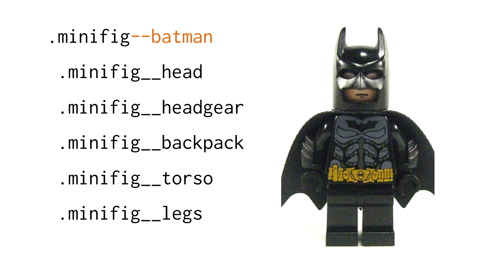
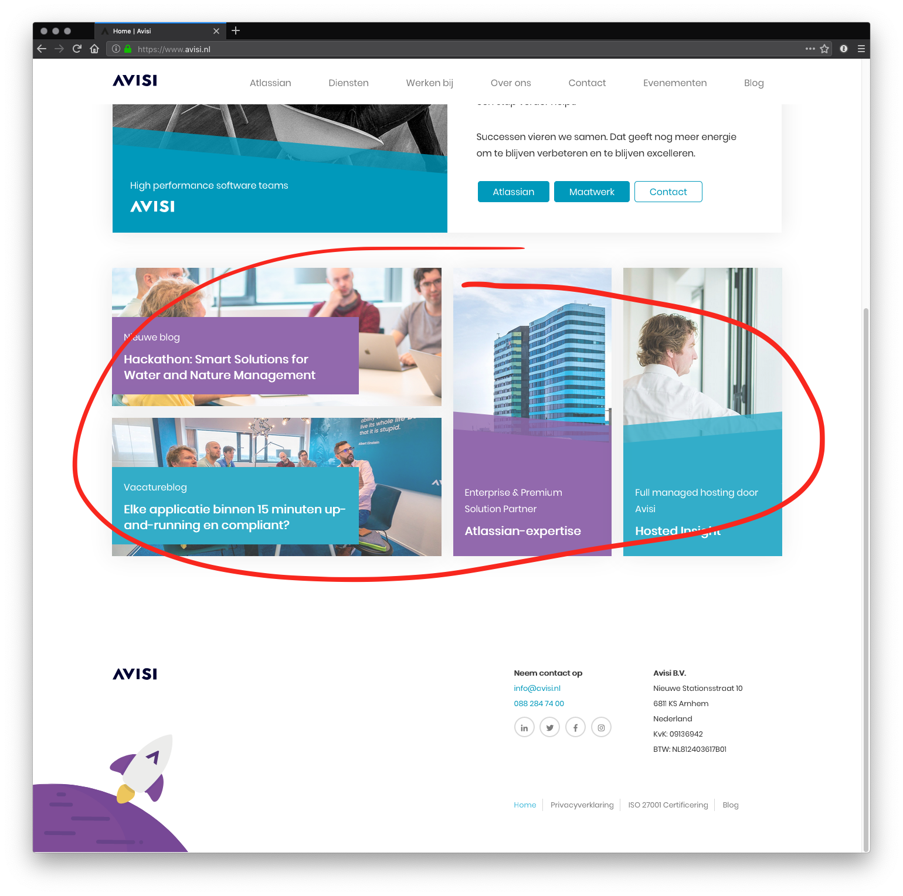
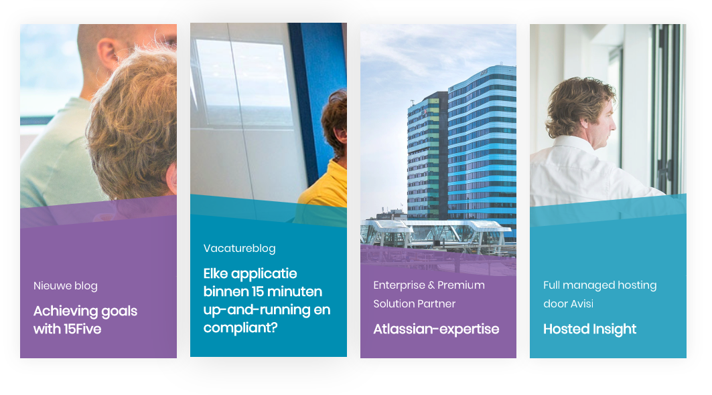
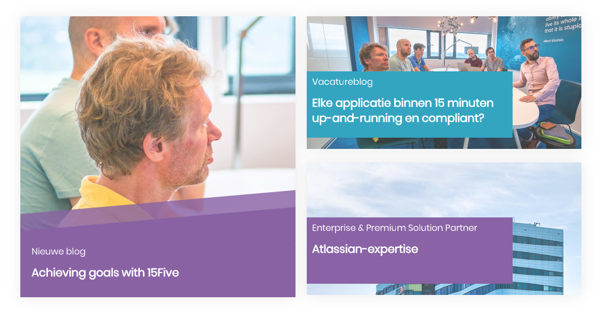
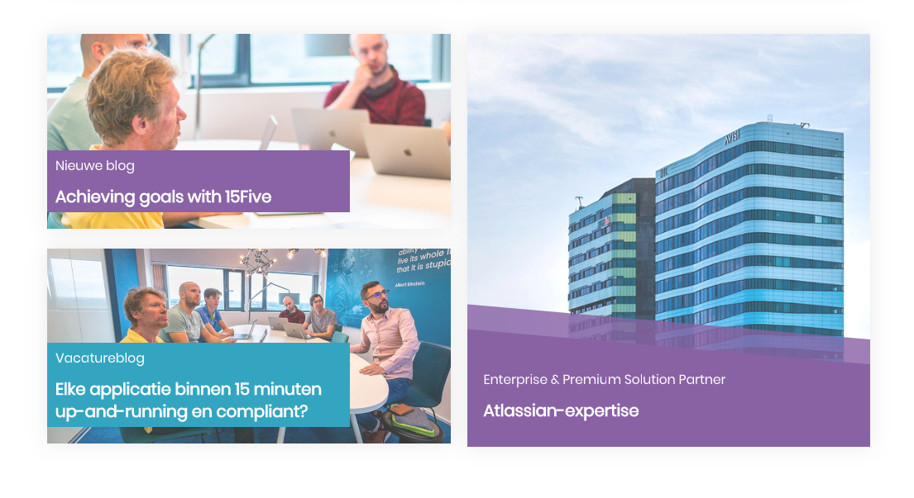
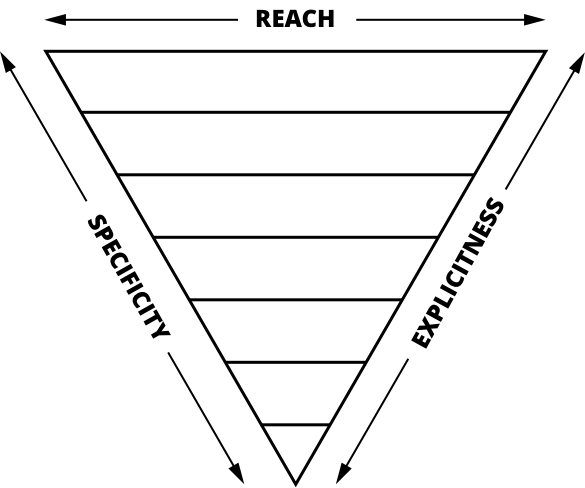
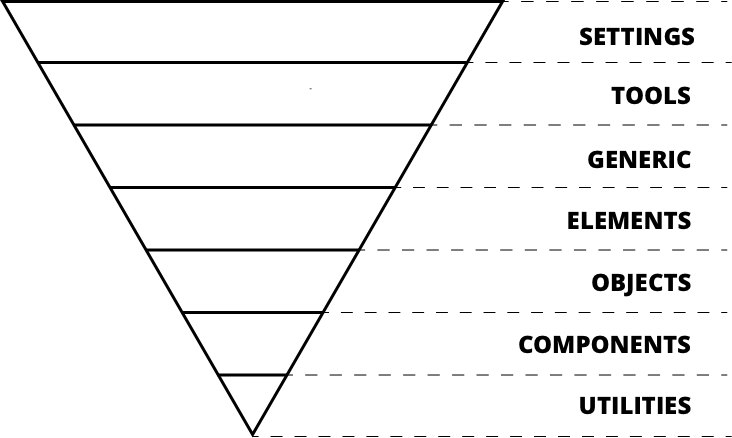

autoscale: true
slidenumbers: true

# BEMIT, CSS!

---

# `$ whoami`

```bash
Brian van Burken
Software Engineer @ Avisi
```

---


^ css is hard in 2 ways: browser and how we write it

---

# What is BEMIT?

Q: How do we write our CSS?
A: BEM

Q: How do we structure our CSS?
A: ITCSS

---

# BEM

Stands for *B*lock *E*lement *M*odifier

---

> "BEM is a way to *modularize* development of web pages. By breaking you web interface into components... you can have your interface divided into *independent part*, each one with its own development cycle."
-- Varya Stepanova

---


---


---


---



---



^ voorbeeld hoe wij het bij Avisi doen

---

```
.tiles
  .tiles--4v
  .tiles--2v2h
  .tiles--2h2v
  .tiles--1h2v
  .tiles--2h1v

.tile
  .tile--green
  .tile--blue
  .tile--orange
  .tile--purple

  .tile--left
  .tile--right
  .tile--none
```

---

# tiles--2v2h


---

# tiles---4v


---

# tiles--2h2v


---

# tiles--1h2v


---

# tiles--2h1v


^ laatste slide met foto

---

> 5 * 4 * 3 = 60 options!

^ bijna 5 factorial
  preprocessor SASS
  

---

# ITCSS

Stands for *I*nverted *T*riangle *CSS*

---

> "*Inverted Triangle* architecture for *CSS*. A sane, scalable, *managed architecture*. A *school-of-thought*, not a library. A *meta framework*; a framework for frameworks. Incredibly *simple*.
-- Harry Roberts

---



^ start wide reaching many aspects 
  end more explicit

---



^ Settings: all your variables like colors, fonts, sizes etc.
  Tools: handy functions like ours: converting px to rem
  Generic: Here goes reset files like normalize.css and setting global box-sizing
  Elements: target default html elements like a and h1
  Objects: class based selectors. An example given is media object from OOCSS (we don't use this dir much)
  Components: UI components. This is where our tile component lives
  Utilities: all helper classes like a hiding class (only place ever where you could use !important)

---

~~DAMN~~BEMIT, CSS!

---

# git.io/fx1z7

^ build your own toolkit or structure a project you have
